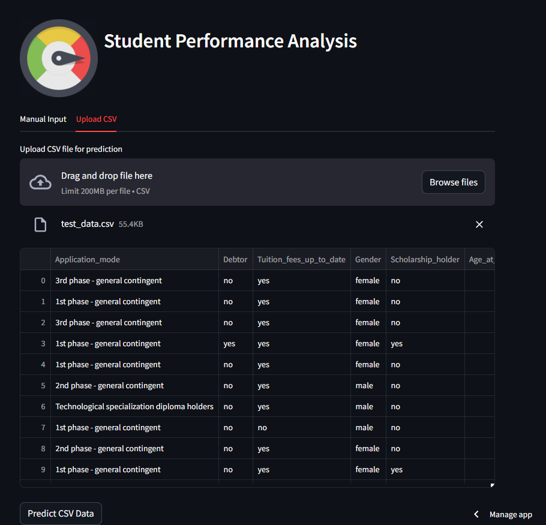

# Proyek Akhir: Menyelesaikan Permasalahan Jaya Jaya Institute

## Business Understanding
Jaya Jaya Institut adalah sebuah institusi pendidikan perguruan yang telah berdiri sejak tahun 2000. Mereka telah mencetak banyak lulusan dengan reputasi yang sangat baik, tetapi mereka juga menghadapi tantangan dalam mengatasi jumlah mahasiswa yang melakukan dropout. Mereka ingin mengidentifikasi mahsiswa yang berisiko dropout secepat mungkin agar bisa memberikan bimbingan khusus kepada mereka.

### Permasalahan Bisnis
Permasalahan utama yang dihadapi oleh Jaya Jaya Institut adalah tingginya jumlah mahasiswa yang melakukan dropout. Dropout mahasiswa mengakibatkan kerugian baik bagi institusi maupun mahasiswa tersebut secara pribadi. Bagi institusi, ini berarti kehilangan pendapatan dari mahasiswa yang tidak menyelesaikan pendidikan mereka, serta dapat merusak reputasi institusi. Sedangkan bagi mahasiswa, dropout dapat berdampak negatif pada masa depan mereka, termasuk kesempatan kerja dan penghasilan.

### Cakupan Proyek
Proyek ini akan fokus pada analisis data mahasiswa untuk mengidentifikasi faktor-faktor yang mempengaruhi dropout, pembuatan business dashboard interaktif untuk memvisualisasikan temuan analisis secara intuitif, dan pengembangan solusi machine learning untuk memprediksi mahasiswa yang berisiko dropout. Tahap analisis data akan melibatkan pengumpulan, pemrosesan, dan eksplorasi data untuk mengidentifikasi pola dan tren yang relevan. Selanjutnya, business dashboard akan dibuat untuk menyajikan informasi kritis tentang kinerja mahasiswa dan tingkat dropout secara langsung kepada pihak berkepentingan. Selain itu, solusi machine learning akan dikembangkan untuk memprediksi mahasiswa yang berisiko dropout, yang akan diintegrasikan ke dalam dashboard untuk membantu institusi mengambil tindakan pencegahan yang diperlukan. Dengan pendekatan ini, Jaya Jaya Institut akan dapat mengoptimalkan strategi intervensi dan meningkatkan tingkat kelulusan mahasiswa.

### Persiapan

Sumber data: [Lihat Dataset 🗿](https://raw.githubusercontent.com/labibaf/Sudent_Performance_Analysis/main/dataset/data.csv)

Setup environment:
- Install library yang dipakai
```
pip install -r requirements.txt
```
- Buka app.py untuk melakukan prediksi
```
streamlit run app.py
```

## Business Dashboard
Business dashboard telah dibuat untuk memonitor faktor-faktor yang mempengaruhi dropout mahasiswa. Dashboard dapat diakses [disini](https://public.tableau.com/app/profile/labib.fadhali/viz/JayaJayaInstitiutePerformanceDashboard/Dashboard1?publish=yes)


## Menjalankan Sistem Machine Learning
Untuk menjalanka sistem machine learning, buka di [sini](https://studentperformance12.streamlit.app/)



## Conclusion
Berdasarkan analisis yang telah dilakukan, kesimpulan yang dapat diambil adalah bahwa faktor-faktor seperti pembayaran uang sekolah, jumlah unit kurikuler yang disetujui, prestasi akademik, dan status penerima beasiswa memiliki pengaruh signifikan terhadap status mahasiswa, terutama dalam konteks kemungkinan drop out.

Hal ini konsisten dengan apa yang terlihat dalam pie chart, di mana presentasi mahasiswa yang dropout cukup besar, mencapai 32,1%. Sementara itu, persentase mahasiswa yang lulus adalah 49,9%, dan mahasiswa yang masih terdaftar tetapi belum lulus sebesar 17,9%.

### Rekomendasi Action Items
1. **Program Bantuan Keuangan**: Sediakan program bantuan keuangan atau skema pembayaran yang fleksibel bagi mahasiswa yang mengalami kesulitan dalam membayar uang sekolah. Hal ini dapat mencakup opsi cicilan, beasiswa, atau program bantuan keuangan lainnya untuk membantu mahasiswa tetap terdaftar tanpa harus khawatir tentang masalah keuangan.
2. **Program Peningkatan Prestasi Akademik**: Sediakan program khusus yang bertujuan untuk meningkatkan prestasi akademik mahasiswa, seperti workshop studi, mentoring akademik, atau program pengembangan keterampilan belajar. Dengan demikian, mahasiswa dapat lebih siap dan termotivasi untuk menyelesaikan studi mereka.
3. **Pelatihan Tenaga Pengajar**: Berikan pelatihan kepada tenaga pengajar tentang cara mengidentifikasi dan memberikan dukungan kepada mahasiswa yang mengalami kesulitan akademik atau keuangan. Hal ini dapat membantu meningkatkan kualitas pengajaran dan memberikan dukungan yang lebih efektif kepada mahasiswa.